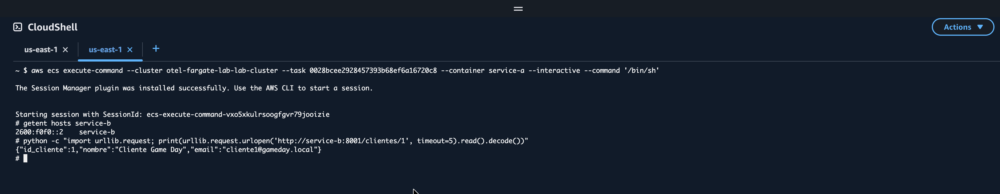
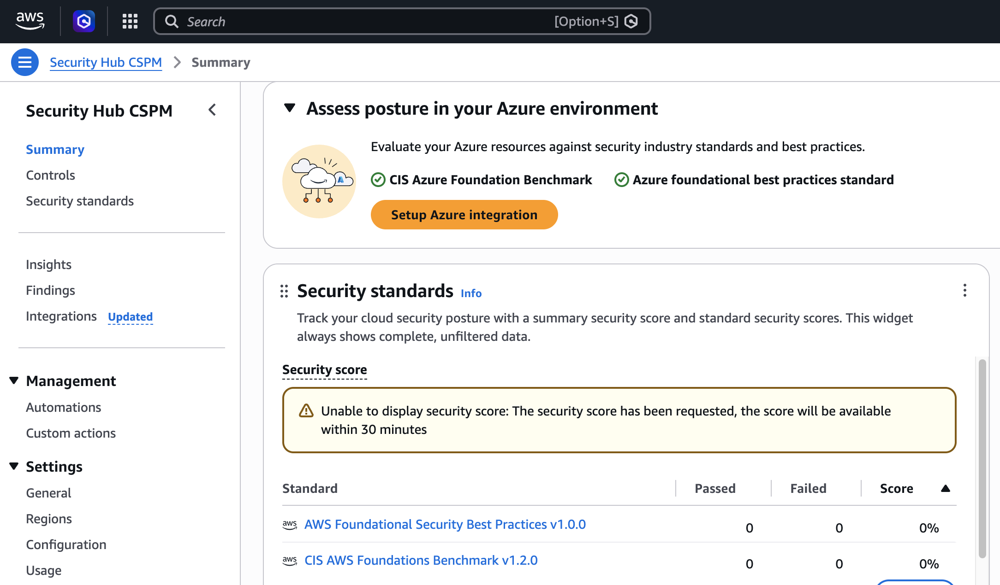

# Informe final — Laboratorio integrador de observabilidad en AWS

## Resumen ejecutivo

El laboratorio implementa una plataforma de tres servicios observables en un sandbox **AWS-only**. La solución integra ECS/Fargate, Application Load Balancer (ALB), ECS Service Connect, Amazon RDS PostgreSQL, AWS Distro for OpenTelemetry (ADOT), CloudWatch Logs/Metrics y X-Ray. Se demostraron flujo funcional, telemetría correlacionada, dos experimentos de caos, una alarma estática de control y un MTTD de 53,213 s para esa alarma.

El alcance excluye GCP/Cloud SQL por decisión explícita del equipo. Por tanto, este informe no reclama el nivel Excelente en criterios que exigen dos nubes. Tampoco declara AIOps completo: la banda de anomalías fue configurada y aplicada, pero todavía carece de historial suficiente para detectar; faltan correlación p99/`trace_id`, comparación cuantitativa de ruido y accionabilidad, además de AWS DevOps Guru.

## 1. Objetivo y alcance

El objetivo fue extender el laboratorio 2.2 hacia una solución observable con arquitectura de microservicios, trazabilidad distribuida, señales de red y seguridad, experimentos de caos controlados y evidencia cuantitativa de detección.

| Tema | Alcance realizado | Límite declarado |
|---|---|---|
| Nube | AWS sandbox | No se implementó GCP/Cloud SQL. |
| Servicios | Service A, Service B y `data-service` | No se afirma cumplimiento multicloud. |
| Observabilidad | Logs, métricas y trazas con ADOT y destinos AWS | No se afirma dashboard de seguridad completo. |
| AIOps | Métrica de errores, alarma estática y banda de anomalías `2σ` | La anomalía dinámica no cuenta aún con historial suficiente. |
| Chaos | Latencia en Service B y 10 % de errores en `data-service` | Falta p99 durante el caos y correlación de alerta con `trace_id`. |

## 2. Arquitectura implementada

La entrada pública se concentra en un ALB que enruta hacia Service A. Service A consulta Service B y delega la creación de pedidos a `data-service`. Los servicios internos se descubren mediante ECS Service Connect; `data-service` y Service B acceden a PostgreSQL en Amazon RDS. ADOT recibe OTLP por gRPC/HTTP y exporta las señales a servicios administrados de AWS.

```text
Cliente
  │ HTTP
  ▼
ALB ──► Service A (ECS/Fargate) ──► Service B (ECS/Fargate)
                 │                         │
                 └────► data-service (ECS/Fargate) ─► RDS PostgreSQL
                              │
                              └── OTLP ─► ADOT (ECS/Fargate)
                                               ├─► CloudWatch Logs
                                               ├─► CloudWatch Metrics
                                               └─► X-Ray / CloudWatch Logs
```

La configuración incluye roles IAM, grupos de seguridad, secretos administrados para RDS, Cloud Map/Service Connect y grupos de logs con retención. El flujo A→B→`data-service`→RDS respondió HTTP 200 en la evidencia funcional. La prueba de conectividad mediante ECS Exec evidencia la resolución del alias privado de Service B:



**Límite de evidencia:** las capturas textuales de Service Connect disponibles son incompletas; la imagen anterior y las pruebas funcionales se presentan como evidencia de conectividad, no como demostración exhaustiva de toda la malla L7.

## 3. Telemetría OpenTelemetry

Los tres pilares se instrumentaron de la siguiente forma:

| Pilar | Implementación | Evidencia |
|---|---|---|
| Logs | Aplicaciones y ADOT exportan logs a CloudWatch Logs. | `aws/observabilidad/04-otel-xray-active-20260903T043329Z.log` |
| Métricas | Las aplicaciones emiten OTLP; ADOT exporta métricas a CloudWatch. | Configuración `otel-collector-config-aws.yaml`; datapoint AIOps posterior. |
| Trazas | ADOT exporta trazas a X-Ray/CloudWatch Logs. | Mismo `traceId` a través de Service A, B y `data-service`. |

La evidencia final de OpenTelemetry registra `CloudWatchLogs` en estado `ACTIVE`, una solicitud HTTP 200 a través del flujo distribuido y spans correlacionados. Esta correlación prueba la propagación de trazas del flujo funcional; **no** prueba la correlación p99/`trace_id` dentro de una alerta AIOps.

## 4. AIOps y detección

Se aplicó Terraform para derivar la métrica `DataServiceChaosErrors` desde el mensaje estable `Controlled order failure injected` en los logs de aplicación. Se configuraron dos alarmas:

1. **Alarma estática de control:** entra en `ALARM` cuando hay al menos un error controlado durante 60 segundos.
2. **Alarma de anomalías:** usa `ANOMALY_DETECTION_BAND(m1, 2)` sobre la misma métrica.

Durante el experimento AIOps, CloudWatch registró `DataServiceChaosErrors=3` y la alarma estática transitó a `ALARM`. El inicio fue `2026-09-03T06:46:26Z` y la transición `OK_TO_ALARM` ocurrió a `2026-09-03T06:47:19.213Z`, por lo que el MTTD estático fue **53,213 s**, menor que el objetivo de 120 s.

La alarma de anomalías se mantuvo en `OK` porque no disponía de historial suficiente para el aprendizaje. Esto es una limitación operativa esperable de la detección basada en bandas; no se interpreta como ausencia de errores ni como detección dinámica validada.

## 5. Red y seguridad

VPC Flow Logs se configuró para todo el tráfico, con agregación de 60 segundos, entrega a CloudWatch Logs, filtro métrico de registros `REJECT` y alarma asociada. La evidencia disponible confirma delivery activo, streams recientes y registros `ACCEPT/REJECT`.

AWS Security Hub está habilitado y la evidencia conserva dos estándares en estado `READY`:



Estas señales no constituyen un dashboard de seguridad completo. Permanecen pendientes las consultas Norte-Sur, Este-Oeste y entre servicios; el análisis de CVEs activos; la señal de autenticación fallida; y un dashboard que consolide esas fuentes.

## 6. Experimentos de caos y rollback

| Experimento | Blast radius y duración | Resultado | Rollback |
|---|---|---|---|
| Latencia de 200 ms en Service B | Solicitud directa desde Service A; intervención acotada al lookup de clientes. | HTTP 200 en 234 ms. | Configuración revertida como parte del Game Day. |
| Error de 10 % en `data-service` | 30 solicitudes directas desde ECS Exec hacia la IP privada del proceso para aislar el experimento. | 27 HTTP 201 y 3 HTTP 503 `CHAOS_INJECTED`; 10 % observado. | Terraform reportó `2 added, 2 changed, 2 destroyed`; el equipo confirmó posteriormente Service B y `data-service` `COMPLETED` y estables. |

El archivo de rollback `aws/chaos/07-chaos-rollback-20260903T062602Z.log` contiene una captura intermedia con los dos servicios en `IN_PROGRESS`. No se fabricó una tabla final: la estabilidad posterior se reporta como confirmación operativa del equipo y no sustituye esa limitación documental.

## 7. SLO y error budget

El SLO definido para la ventana de cinco minutos es disponibilidad ≥99 %, `error_rate` ≤1 % y latencia p99 ≤750 ms. El presupuesto de error asociado es 1 % de las solicitudes de la ventana.

| Indicador del experimento 2 | Resultado | Evaluación |
|---|---:|---|
| Solicitudes | 30 | Muestra de caos |
| Exitosas / errores | 27 / 3 | — |
| Disponibilidad | 90 % | Incumple ≥99 % |
| `error_rate` | 10 % | Incumple ≤1 % |
| Consumo de error budget | 10× el presupuesto de 1 % | Excedido |
| p99 durante caos | No medida | No evaluable |

La alerta estática detectó el datapoint en 53,213 s. Sin embargo, al no medirse p99 durante la ventana de caos, no se puede cerrar la evaluación completa del SLO ni presentar una correlación p99/`trace_id`.

## 8. Autoevaluación operativa de madurez

La siguiente tabla es un **mapeo operativo de ocho dominios** para organizar la entrega. El Observability Foundation Blueprint exacto de la asignatura no fue entregado, por lo que esta autoevaluación no debe presentarse como la clasificación oficial del blueprint.

| Dominio operativo | Nivel 1–5 | Evidencia / situación | Siguiente acción |
|---|---:|---|---|
| Arquitectura observable | 3 | Tres servicios, RDS, ADOT y flujo funcional AWS. | Consolidar evidencia íntegra de Service Connect. |
| Logs | 3 | Logs centralizados y exportación activa. | Definir consultas operativas y retención basada en uso. |
| Métricas y SLO | 2 | Baseline, métrica de caos y cálculo de presupuesto. | Medir p99 durante caos y revisar ventanas. |
| Trazas | 3 | Correlación distribuida A/B/data-service. | Vincular alerta AIOps con `trace_id`. |
| AIOps | 2 | Alarma estática y banda `2σ` aplicada. | Esperar aprendizaje, medir dinámica y comparar ruido. |
| Red | 2 | Flow Logs y alarma `REJECT`. | Analizar tráfico N-S/E-W/entre servicios. |
| Seguridad | 2 | Security Hub `READY` y controles de infraestructura. | CVEs, autenticación fallida y dashboard consolidado. |
| Operación y entrega | 2 | Evidencia e informe preparados. | Ensayar demo, revisión final y tag. |

## 9. Roadmap accionable a tres meses

| Horizonte | Iniciativa | Responsable sugerido | Criterio de éxito |
|---|---|---|---|
| Semanas 1–2 | Estabilizar AIOps | SRE/observabilidad | Banda de anomalías con historial, MTTD dinámico y alarma vinculada a una traza. |
| Semanas 3–4 | Completar SLO | Equipo de aplicaciones | Medición p99 de caos, error budget por ventana y decisión de remediación. |
| Mes 2 | Seguridad y red operables | Plataforma/seguridad | Consultas N-S/E-W, CVEs, fallos de autenticación y dashboard mínimo. |
| Mes 2 | Control de ruido | SRE | Comparación estática/dinámica con alertas totales, falsas y accionables. |
| Mes 3 | Resiliencia y entrega | Equipo completo | Game Day con abort conditions, rollback verificable y demo reproducible. |
| Mes 3 | Escalamiento académico | Equipo completo | Evaluar segunda nube si el objetivo pasa a exigir cumplimiento multicloud. |

## 10. Guion de demostración técnica

1. Mostrar el alcance AWS-only y las brechas multicloud declaradas.
2. Presentar arquitectura, ALB, ECS/Fargate, Service Connect, RDS y ADOT.
3. Ejecutar o reproducir el flujo funcional A→B→`data-service`→RDS y mostrar logs/trazas correlacionadas existentes.
4. Mostrar la métrica `DataServiceChaosErrors=3`, la transición de alarma estática a `ALARM` y el MTTD de 53,213 s.
5. Explicar por qué la banda `2σ` permanece `OK`: falta historial de aprendizaje.
6. Revisar los dos experimentos, blast radius, rollback y la limitación del archivo 07.
7. Mostrar Flow Logs y los estándares `READY` de Security Hub, diferenciando señales disponibles de dashboard pendiente.
8. Cerrar con SLO/error budget, brechas abiertas, roadmap y el siguiente paso de revisión/tag/entrega.

## 11. Índice de evidencias

| Área | Ruta relativa | Uso |
|---|---|---|
| Flujo ECS/RDS | `aws/ecs/02-smoke-test-rds-20260903T031815Z.log` | Flujo HTTP 200 con pedido persistido. |
| Activación OTel | `aws/ecs/03-otel-activation-status-success.txt` | Servicios y ADOT activos. |
| Trazas/logs | `aws/observabilidad/04-otel-xray-active-20260903T043329Z.log` | Destino activo y correlación de spans. |
| Service Connect | `aws/service-connect/04-ecs-exec-conectividad-service-b.png` | Resolución y conectividad al alias. |
| Baseline | `aws/chaos/00-baseline-20260903T050115Z.log` | 30/30 respuestas HTTP 200. |
| Chaos Service B | `aws/chaos/03-service-b-direct-latency-cloudshell.log` | Latencia controlada de 200 ms. |
| Chaos `data-service` | `aws/chaos/06-data-service-direct-ip-10pct-20260903T062008Z.log` | 3/30 errores controlados. |
| AIOps | `aws/aiops/03-aiops-cloudwatch-datapoint-20260903T064600Z.log` | Métrica 3 y alarma estática `ALARM`. |
| MTTD | `aws/aiops/05-mttd-static-alarm-20260903T064719Z.log` | MTTD estático de 53,213 s. |
| SLO/error budget | `aws/aiops/04-slo-error-budget-analysis.md` | Análisis cuantitativo de la ventana. |
| Red | `aws/network/01-vpc-flow-logs-20260903T044925Z.log` | Flow Logs, `ACCEPT/REJECT` y alarma. |
| Seguridad | `aws/security-hub/01-standards-ready.json` | Estados `READY` sanitizados. |

## 12. Brechas restantes

- MTTD de la alarma de anomalías dinámica y aprendizaje suficiente de su banda.
- p99 durante caos y correlación p99/`trace_id` dentro de una alerta.
- Comparación cuantitativa de ruido y accionabilidad entre control estático y detección dinámica.
- AWS DevOps Guru, que no fue implementado.
- Dashboard de seguridad, consultas N-S/E-W/entre servicios, CVEs y señal de autenticación fallida.
- Validación oficial de los ocho dominios del blueprint, demostración final y tag `v1.0`.
- Requisito multicloud: GCP/Cloud SQL permanece fuera de alcance.

## Conclusión

La plataforma alcanza un estado parcialmente demostrado: hay arquitectura AWS funcional, telemetría distribuida, seguridad y red con señales iniciales, dos experimentos de caos, alarma estática con MTTD inferior a dos minutos y una cuantificación honesta del impacto sobre disponibilidad/error budget. Las brechas se mantienen visibles para que la revisión final valore evidencia comprobable, no resultados esperados.

## Key Learnings:

1. La alarma estática detectó los tres errores controlados en 53,213 s, pero esa medición no valida la detección dinámica por anomalías.
2. La ventana de caos consumió diez veces el presupuesto de error; sin p99 no puede cerrarse el SLO completo.
3. El alcance AWS-only limita la demostración frente a criterios multicloud, aunque la evidencia AWS sea funcional.
